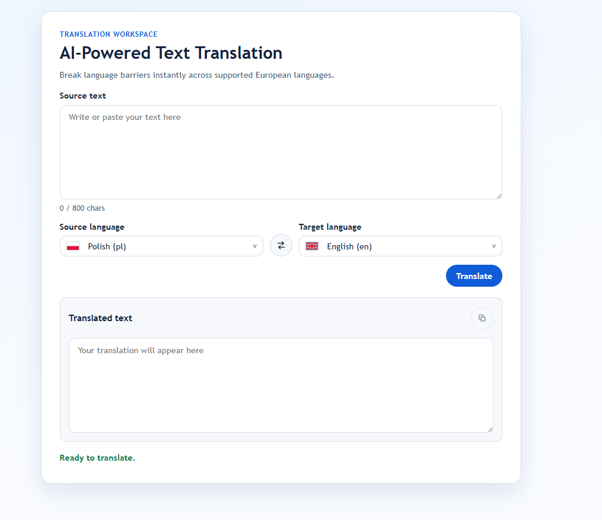
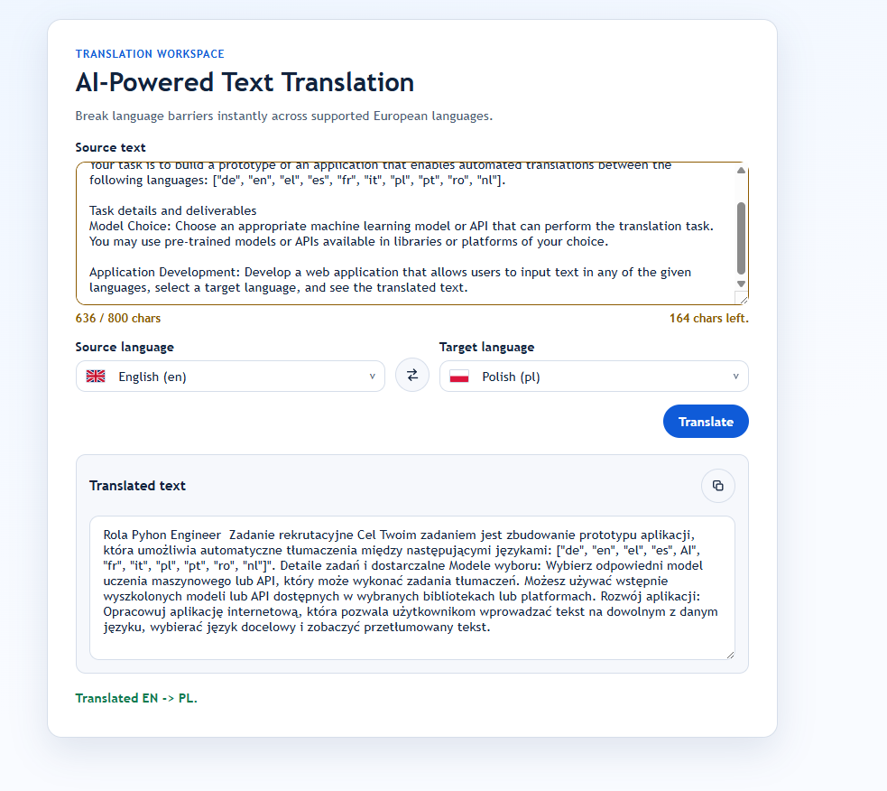

# Translation App Documentation

This project is a multilingual translation web app built with FastAPI, a modular hexagonal architecture, and the `facebook/nllb-200-distilled-600M` model. It demonstrates how to integrate AI into a production-minded backend with clear separation of concerns, reusable components, and container-ready deployment.

## Highlights

- Translates text across 10 fixed languages through a simple web interface and API.
- Uses hexagonal architecture to separate routes, use cases, domain rules, and the AI adapter.
- Loads the model once at startup and reuses it across requests with strict validation and stable error handling.
- Runs locally with Python or Docker and is structured for container-based deployment.

## Quick Start

- Fastest run: `docker compose up --build`
- App: `http://localhost:8000`
- API docs: `http://localhost:8000/docs`

## Stack and Rationale

- FastAPI + Uvicorn for the API layer.
- Hexagonal architecture for modular backend design.
- Hugging Face Transformers + PyTorch + NLLB for local multilingual inference.
- HTML, CSS, and vanilla JavaScript for the frontend.
- Docker and Docker Compose for reproducible setup.


## Requirement Coverage

| Recruitment requirement | Covered in section |
|---|---|
| 1. Model choice | Architecture |
| 2. Web app with translation flow | Architecture |
| 3. Backend and frontend design | Architecture |
| 4. Running locally | Run Locally, Run with Docker |
| 5. Scalability and cloud deployment | Scalability and Deployment |
| 6. Approach, architecture, setup, risks/ethics | Architecture, Run Locally, Run with Docker, Risks and Ethics |

## GUI Preview

### Main view



### Translation result view



## Architecture

### Business objective

The application translates text between 10 fixed languages:
`de`, `en`, `el`, `es`, `fr`, `it`, `pl`, `pt`, `ro`, `nl`.

### Business approach

- Fixed scope: one translation flow and 10 supported languages.
- Model loaded at startup, with strict validation and stable error codes.
- UI uses explicit source/target selection and immediate feedback.

### Model choice

- Model: `facebook/nllb-200-distilled-600M`.
- Reason: supports all required languages and runs locally on CPU.
- Cost note: this CPU-first setup is usually cheaper to operate than a larger GPU model or paid external translation API.
- Runtime decision: load tokenizer and model once at startup, then reuse them for requests.

### Stack and design decisions

- Backend: FastAPI + hexagonal architecture.
- Frontend: static HTML/CSS/JS served by FastAPI.
- Integration: Hugging Face Transformers + PyTorch in outbound adapter.
- Dependency wiring: dependencies are built at application startup.

### Backend structure

- `backend/app/adapters/inbound/http`: HTTP routes and schemas.
- `backend/app/application` + `backend/app/application/ports`: use cases, DTOs, and translator contract.
- `backend/app/domain`: language rules and domain errors.
- `backend/app/adapters/outbound/nllb_translator.py`: NLLB adapter.
- `backend/app/bootstrap/container.py` + `backend/app/core/config.py`: wiring and runtime settings.

### API surface

- `GET /api/health`: service status, model id, and model loaded flag.
- `GET /api/languages`: supported language codes.
- `GET /api/frontend-config`: frontend limits derived from backend settings.
- `POST /api/translate`: translation endpoint.

### Runtime flow

1. App startup builds `AppContainer` and initializes `NllbTranslator`.
2. `POST /api/translate` creates `TranslateCommand`.
3. `TranslateTextUseCase` trims text and validates language pair.
4. `NllbTranslator` tokenizes input, enforces limits, and generates output.
5. Route maps domain/adapter errors to stable HTTP responses.

### Error mapping

- `400`: unsupported language or invalid language pair.
- `422`: request schema validation errors, empty text, or token limit errors.
- `503`: translation backend/runtime failures (masked with generic message).
- `500`: unexpected internal errors.

### Key trade-offs

- Benefit: clear separation of HTTP layer, business rules, and model code.
- Benefit: translator backend can be replaced through `TranslatorPort`.
- Cost: more files and higher runtime footprint than a single-file app.

## Run Locally

### Requirements

- Python `3.12`.
- Internet access on first start (model download).

### Setup and run

From project root:

```bash
python -m venv .venv
```

Activate virtual environment:

- Windows PowerShell:

```bash
.venv\Scripts\Activate.ps1
```

- Linux/macOS:

```bash
source .venv/bin/activate
```

Install dependencies:

```bash
pip install -r requirements.txt
```

Start backend + frontend (frontend is served by FastAPI static files):

```bash
uvicorn app.main:app --host 0.0.0.0 --port 8000 --app-dir backend
```

Application URLs:

- `http://localhost:8000` - frontend
- `http://localhost:8000/api/health` - health endpoint
- `http://localhost:8000/docs` - FastAPI OpenAPI docs

### Optional runtime configuration

- `APP_MODEL_ID` (default `facebook/nllb-200-distilled-600M`)
- `APP_DEVICE` (default `cpu`, accepts `cpu`, `mps`, `cuda`, `cuda:<index>`)
- `APP_MAX_INPUT_TOKENS` (default `1024`)
- `APP_MAX_NEW_TOKENS` (default `512`)
- `APP_REPETITION_PENALTY` (default `1.2`)
- `HF_HOME`, `HF_HUB_CACHE`, `TRANSFORMERS_CACHE` (model cache location)

### Run tests

```bash
pytest
```

## Run with Docker

### Requirements

- Docker Desktop (or Docker Engine + Docker Compose).
- Internet access on first start to download Hugging Face model artifacts.

### Start application

From the project root:

```bash
docker compose up --build
```

Application URLs:

- `http://localhost:8000` - frontend
- `http://localhost:8000/api/health` - health endpoint
- `http://localhost:8000/docs` - FastAPI OpenAPI docs

Notes:

- First startup can take a few minutes because model files are downloaded.
- Next startups are faster because `huggingface_cache` is persisted as a Docker volume.

### Run in background

```bash
docker compose up --build -d
```

View logs:

```bash
docker compose logs -f
```

### Stop and cleanup

Stop containers:

```bash
docker compose down
```

Stop and remove containers with model cache volume:

```bash
docker compose down -v
```

## Scalability and Deployment

### Current state (prototype)

- One container runs FastAPI and the in-process translation model.
- Model is loaded on startup and reused by requests.
- Suitable for local use and low traffic.

### Cloud deployment target

1. Build and publish Docker image to container registry.
2. Deploy stateless API replicas behind a load balancer.
3. Keep model files in persistent storage (for example S3/Blob or Kubernetes PV) to avoid re-download on restart.
4. Keep app settings in environment variables and secrets in a secrets manager.

### Scaling strategy

- Implemented now: containerized stateless API (`Dockerfile` + `AppSettings.from_env`) supports horizontal scaling by duplicating current containers; the load balancer (`loader`) routes traffic across replicas.
- Implemented now: each replica loads model at startup, uses a generation lock in `NllbTranslator`, and exposes readiness through `GET /api/health`.
- Implemented now: request limits (`APP_MAX_INPUT_TOKENS`, `APP_MAX_NEW_TOKENS`) and explicit error mapping protect stability.
- Implemented now: `TranslatorPort` keeps translation behind an interface, so API/worker split can be added without changing use-case logic.
- Next step (horizontal scaling): duplicate current containers behind the same load balancer (`loader`), then use rolling deployments and autoscaling.
- Next step (vertical scaling): run larger instances (more CPU/RAM) or GPU nodes per replica when single-request latency is the bottleneck.
- Next step (architecture): split API and workers with queue-based async processing for long-running translation jobs.

### Performance and cost controls

- Keep warm replicas to reduce cold starts.
- Keep input/output limits to protect latency and memory.
- Route large or batch requests to dedicated workers when needed.
- Change model size only after quality/latency/cost measurements.

### Observability and security

- Observability: latency/error metrics, queue depth, model load time, and request tracing.
- Security: structured logs without raw sensitive text, TLS, network policy, secret management, and retention policy.

## Trade-offs and Recommendations

### Current constraints

- Model context is limited; longer texts can lose context quality.
- Backend enforces hard token limit: `APP_MAX_INPUT_TOKENS` (default `1024`).
- Backend output length is capped by `APP_MAX_NEW_TOKENS` (default `512`).
- Frontend uses character-based heuristics from `/api/frontend-config`:
  - default max characters: `800` (`400` tokens * `2` chars/token),
  - default warning threshold: `600` characters (`75%`).

### Why this works now

- Prevents oversized requests from overloading local inference.
- Keeps response time and memory predictable.
- Gives early feedback before server-side rejection.

### Recommended next steps

1. Add token-count endpoint (`POST /api/tokens`) for exact frontend limits (extra endpoint to maintain).
2. Add text chunking for long documents (supports larger inputs, but reduces cross-chunk context).
3. Add async job mode for heavy requests (better API latency, but requires queue and status handling).
4. Re-evaluate model size after collecting quality metrics (possible quality gain, higher infra cost).
5. Optional source-language auto-detection (better UX, added runtime complexity).

## Risks and Ethics

### Quality risks

- Translation quality can degrade for slang, idioms, and domain-specific language.
- Longer input increases context-loss risk.

### Model and fairness risks

- The model can reproduce bias patterns present in training data.
- Risk is high for legal, medical, and financial content without human review.

### Privacy and security risks

- Input text may contain sensitive data and personal information.
- Production deployments should avoid logging raw user text.
- Data retention and deletion policies should be explicit.

### Operational safeguards

- Require human review when error impact is high.
- Inform users that output can contain mistakes or bias.

